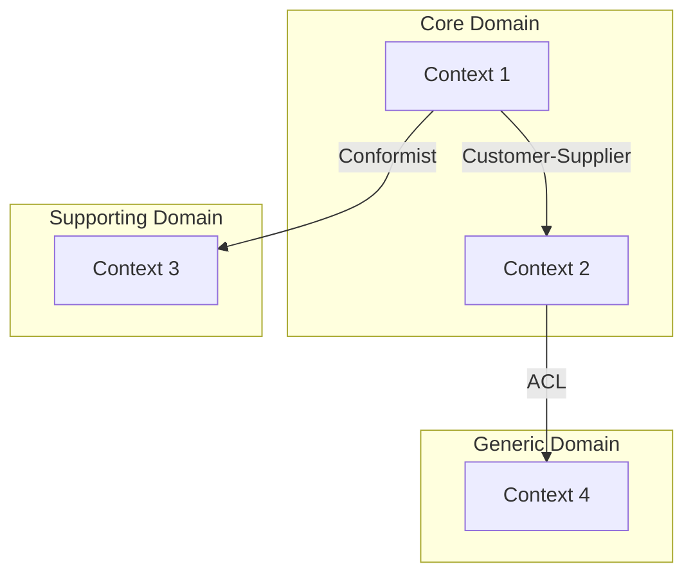
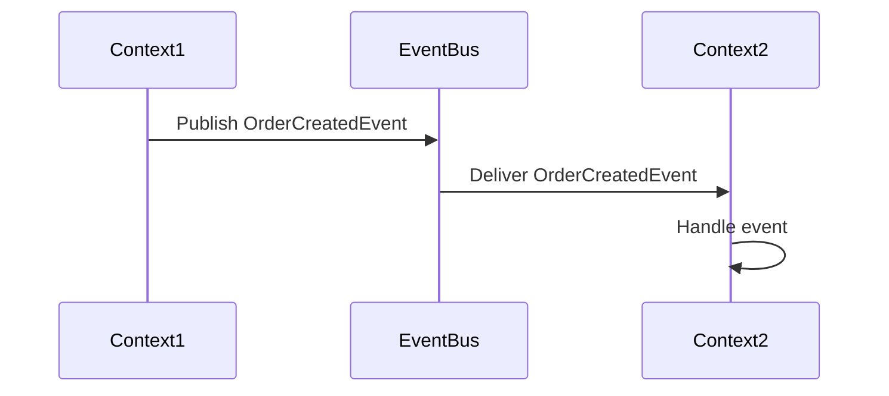
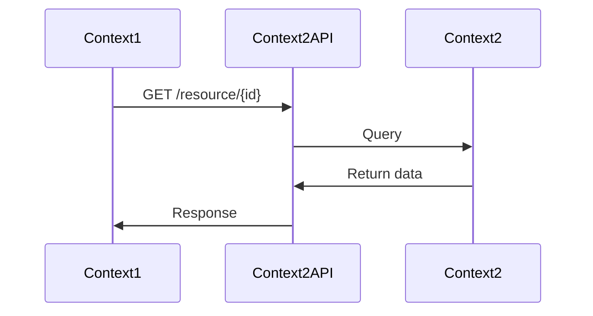

# Context Map

This document describes the bounded contexts in our domain and their relationships.

## Overview Diagram

> Replace this with your actual context map

---

## Bounded Contexts

### [Context Name 1]

**Classification**: Core / Supporting / Generic

**Responsibilities**:
- Responsibility 1
- Responsibility 2

**Key Aggregates**:
- Aggregate 1
- Aggregate 2

**Team/Owner**: [Team name]

---

### [Context Name 2]

**Classification**: Core / Supporting / Generic

**Responsibilities**:
- Responsibility 1
- Responsibility 2

**Key Aggregates**:
- Aggregate 1
- Aggregate 2

**Team/Owner**: [Team name]

---

## Context Relationships

### Relationship Types Reference

| Type | Description | Use When |
|------|-------------|----------|
| **Partnership** | Two teams cooperate on integration | Close collaboration, shared goals |
| **Customer-Supplier** | Upstream serves downstream's needs | Clear provider/consumer relationship |
| **Conformist** | Downstream conforms to upstream model | Limited influence on upstream |
| **Anti-Corruption Layer** | Downstream translates upstream model | Need to isolate from external model |
| **Open Host Service** | Upstream provides standardized API | Multiple consumers, stable interface |
| **Published Language** | Shared language for integration | Need common data format |
| **Shared Kernel** | Shared model subset | Tight coupling acceptable |
| **Separate Ways** | No integration | Contexts are independent |

### [Context A] ↔ [Context B]

**Relationship Type**: [Type from above]

**Direction**: [Context A] → [Context B] (upstream → downstream)

**Integration Mechanism**:
- [ ] Synchronous API
- [ ] Asynchronous Events
- [ ] Shared Database
- [ ] File Transfer

**Shared Data**:
| Upstream Concept | Downstream Concept | Notes |
|------------------|-------------------|-------|
| [Entity/VO] | [Entity/VO] | [Mapping notes] |

**Integration Events**:
| Event | Publisher | Subscriber | Purpose |
|-------|-----------|------------|---------|
| [EventName] | [Context] | [Context] | [Description] |

---

## Anti-Corruption Layers

### [ACL Name]

**Purpose**: [Why this ACL exists]

**External System**: [Name of external system]

**Translation Rules**:

| External Concept | Internal Concept | Transformation |
|------------------|------------------|----------------|
| [External entity] | [Internal entity] | [Mapping logic] |

---

## Shared Kernel

> Document any shared code between contexts

**Shared Between**: [Context A], [Context B]

**Shared Elements**:
- `src/shared/domain/Entity.ts`
- `src/shared/domain/ValueObject.ts`
- [Other shared elements]

**Rules**:
1. Changes require agreement from all context teams
2. Shared kernel should be minimal
3. Test coverage must be maintained

---

## Integration Patterns

### Event-Driven Integration

### API Integration

---

## Future Considerations

> Document planned changes to context boundaries

| Change | Rationale | Timeline | Impact |
|--------|-----------|----------|--------|
| [Planned change] | [Why] | [When] | [Affected contexts] |

---

## Version History

| Date | Change | Author |
|------|--------|--------|
| YYYY-MM-DD | Initial creation | [Name] |
